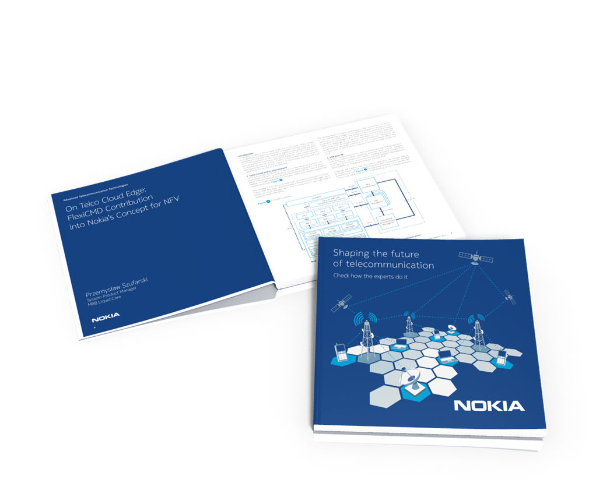

[NOKIA Book 2nd edition](https://github.com/nokia-wroclaw/nokia-book/raw/master/02/NOKIA_Book_2nd.pdf)
========================

Dear Readers,

I am thrilled to present to you another joint effort of employees of Nokia Networks European
Software and Engineering Center in Wrocław: *“[Shaping the Future of Telecommunication.
Check How the Experts Do It.](https://github.com/nokia-wroclaw/nokia-book/raw/master/02/NOKIA_Book_2nd.pdf)”*

This collection of 23 interesting writings extensively covers four aspects of the programmer's
work, including Advanced Technologies, System Engineering, System Development,
and Best Coding Practices. The book takes a broad view of current trends in programming,
and is of great educational value due to its accessible language and real-life case studies.
Therefore, I am very pleased to introduce you to this anthology, and thank the authors for
their passion and willingness to share, hard work, and outstanding contributions.

I wish you a pleasant read,

**Bartosz Ciepluch**  
Head of [Nokia Networks European Software and Engineering Center in Wrocław](http://nokiawroclaw.pl/)

