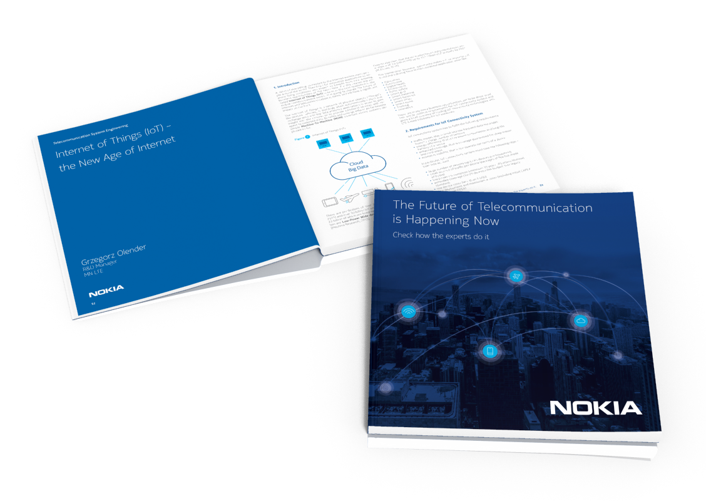

[NOKIA Book 3rd edition](https://github.com/nokia-wroclaw/nokia-book/raw/master/03/NOKIA_Book_3rd_Edition.pdf)
========================

Dear Readers,

The book that you are holding now in your hands is the third part
of Nokia Book series published in the European Software and
Engineering Center in Wroclaw. Traditionally, our specialists have
given their contribution. They have written about the real-life case
studies which are described in the following pages.

*“[The Future of Telecommunication is Happening Now. Check How the Experts Do It](https://github.com/nokia-wroclaw/nokia-book/raw/master/03/NOKIA_Book_3rd_Edition.pdf)”*
shows practical dimension of advanced telecommunication technologies and System Engineering
threads. Our writers, being at the same time developers, testers, researchers, and engineers
in general, did not overlook the topic of professional software development.
Taking into consideration the reference to the title of the book we have written, its content
extensively covers spectrum of prototyping, creating, and developing new technologies like
5G. The readers curious about the new age of technology will also find several significant
articles that deal with Internet of Things, and the future face of Internet.
I sincerely recommend this publication to all enthusiasts of telecommunication, including
those readers who encountered previous editions of Nokia Book. I am sure they will not be
let down by this part. I would also like to thank the authors for their outstanding contribution
and hard work.

I wish you a pleasant read,

**Bartosz Ciepluch**  
Head of [Nokia Networks European Software and Engineering Center in Wrocław](http://nokiawroclaw.pl/)

